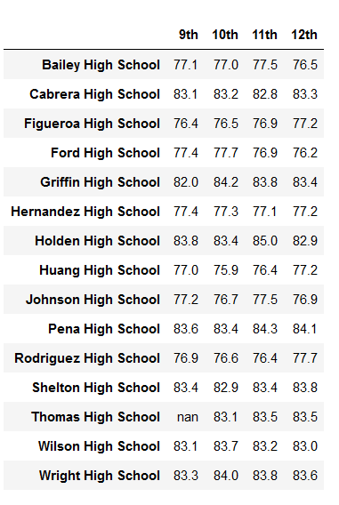
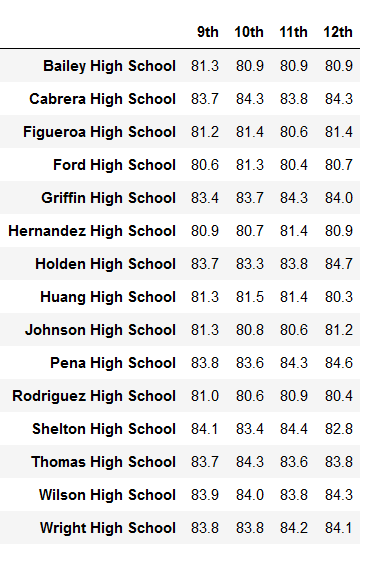
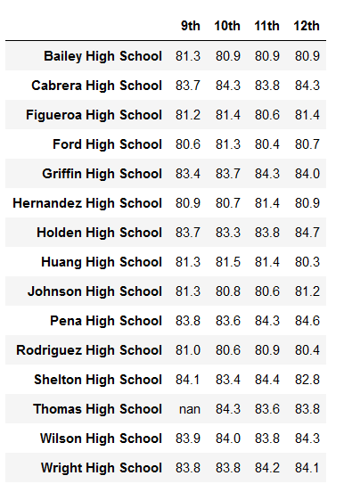

# School_District_Analysis

# Overview of the school district analysis

The school board has reviewed the students_complete.csv and noticed that the evidence of academic dishonesty; specifically, reading and math grades for Thomas High School ninth graders appear to have been altered. As part of the pbservation, thge board decided to take disciplinary action on the highschooler by:

-   Replacing the math and reading scores ny NaN, only for Thomas High School

All other analysis such as funding, graded and school performance need to be analyzed. We're tasked to analyze this data and report how these factors affected the overall analysis

# Results

### How is the district summary affected?

Analysis was performed 2 times. In the first attempt, data included all student data, including Thomas High School and in second attempt, this data was excluded after observations of potential dishonesty.

Below is the summary before and after excluding Tbomas High School student results:

* District Summary(Challenge)

* District Summary(Module4)

### How is the school summary affected?

Replacing the math and reading scores of 9th grade students at Thomas High School with NaN, result has been changed only for Thomas High School and all other school has the same results.
When counting the number of students passing the math/reading, the 9th grade students with "NaN" scores are ignored. Thus, the number of  students passing math/reading is decreased compared with initial analysis. The passing percentage is calculated using the number of students passing the math/reading devided by the total number of students,including 9th graders. As a result, the value for math, reading and overall % Passing for Thomas High School are decreased significantly.
"loc" Method is used to count the total number of students at Thomas High School in 10th grade, 11th grade and 12th grade. The total number of students, except the 9th grade students and resulted in 1174 students. Calculation ignores 9th grade students' scores with "NaN" . Then the total number of students and the number of passing students are both decreased by 9th grade students, so that didn't affect the passing percentage.

The school summary tables for the Thomas High School from the Module analysis and the challenge analysis are as below,

* School Summary(Challenge)

* School Summary(Module4)

### How does replacing the ninth graders’ math and reading scores affect Thomas High School’s performance relative to the other schools?

* Top 5 schools(challenge)
When the ninth graders' of Thomas High School had their scores omitted from the calculations, the following changes occured,

* Top 5 schools(module4)

### How does replacing the ninth-grade scores affect the following:

#### Math and reading scores by grade: 
 That affected only to the Thomas High School, the scores for other schools remain unchanged.

Math scores(module4)                    |  Math scores(Challenge)
:--------------------------------------:|:-------------------------:
  |  

Reading scores(module4)                   |  Reading scores(Challenge)  
:----------------------------------------:|:-------------------------:
 |  

#### Scores by school spending

There is no big difference for the math and reading scores by school spending before and after replacing the 9th grade scores. 

* School Spending Summary(challenge)

* School Spending Summary(module4)

    
#### Scores by school size

Scores by school size are the same after replacing the scores of 9th grade students at Thomas High School.

* Scores by school size(Challenge)

* Scores by school size(module4)

#### Scores by school type

There is no difference between the scores by school type.

* Scores by school type(challenge)

* Scores by school type(module4)

# Summary

Four changes in the updated school district analysis after reading and math scores for the ninth grade at Thomas High School have been replaced with NaNs.

* Thomas High School's overall passing percentages came down after replacing ninth graders scores with NaN.
* Passing percentages have decreased for both the subjects after this change. This impacted overall averages as well.
